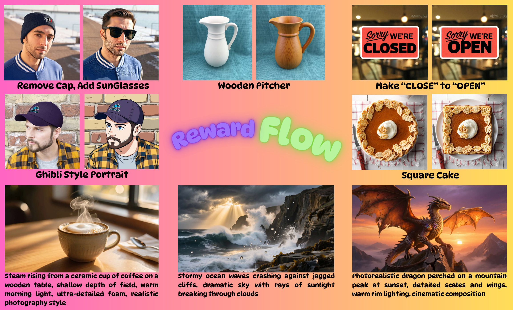

# RewardFlow: Generate Images by Optimizing What You Reward

Accepted at **CVPR 2026**.

## Teaser

[](docs/CVPR2_abs_diagram_8_compressed.pdf)


## Hugging Face Model

[](https://huggingface.co/onkarsus13/RewardFlow)

- https://huggingface.co/onkarsus13/RewardFlow

## Overview

This repository contains RewardFlow code and scripts for:
- running single-image inference (`test_rewardflow.py`)
- generating batch edited images (`pie_solver.py`)
- computing evaluation metrics (`eval.py`)
- All code tested on A100 80GB, There is SDP-Numel error with Ada and Litz architechures

## Repository Layout

- `test_rewardflow.py`: quick single-image RewardFlow inference test.
- `download.py`: helper script to download model files from Hugging Face.

## End-to-End Setup and Run

Run all commands from repo root:

```bash
cd /data/home/onkar/offical_code/RewardFlow
```

### 1) Create Environment

```bash
conda create -n rewardflow python=3.10 -y
conda activate rewardflow
pip install --upgrade pip
```

Install PyTorch for your CUDA version (example for CUDA 12.4):

```bash
pip install torch torchvision --index-url https://download.pytorch.org/whl/cu124
```

Install RewardFlow / diffusers code and runtime dependencies:

```bash
pip install -e ".[torch]"
pip install torchmetrics transformers bitsandbytes sentencepiece opencv-python timm pillow
```

Notes:
- `eval.py` uses `torchmetrics`, `transformers`, and a DINO model loaded via `torch.hub`.
- First metric run may download model artifacts (internet required).

### 2) Download RewardFlow Weights

```bash
export HF_TOKEN=hf_your_token_here   # only needed for private access
python download.py \
  --repo-id onkarsus13/RewardFlow \
  --local-dir /data/onkar/models/RewardFlow
```


### 3) Run Quick Inference Test (`test_rewardflow.py`)

`test_rewardflow.py` has hardcoded paths. Update these two values first:
- `model_dir` (set to your downloaded weights path, e.g. `/data/onkar/models/RewardFlow`)
- input image path in `Image.open(...)` (point to a real image under `annotation_images`)

Then run:

```bash
python test_rewardflow.py
```

## Contact

Please contact to ```onkarks2@illinois.edu``` if you have any doubts regarding the running the code.

## Citation

```bibtex
@inproceedings{rewardflow2026,
  title     = {RewardFlow: Generate Images by Optimizing What You Reward},
  author    = {Susladkar, Onkar Kishor and Jang, Dong-Hwan and Prakash, Tushar and Juvekar, Adheesh Sunil and Shah, Vedant and Barik, Ayush and Bashir, Nabeel and Wahed, Muntasir and Shrirao, Ritish and Lourentzou, Ismini},
  booktitle = {Proceedings of the IEEE/CVF Conference on Computer Vision and Pattern Recognition (CVPR)},
  year      = {2026}
}
```
